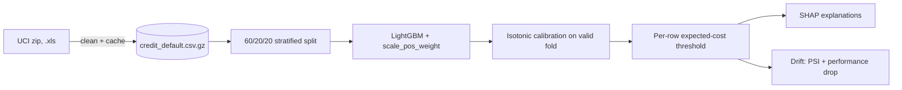

# fraud-calibrated

> Cost-sensitive credit default risk modelling: imbalance, calibration, expected-cost thresholds, SHAP, and drift monitoring.

[](https://github.com/Prithv122/fraud-calibrated/actions/workflows/ci.yml)

**Live demo:** not deployed — CLI project, runs locally by design (see §7 on why a hosted
demo would not actually demonstrate anything a screenshot doesn't).
**Stack:** Python 3.12 · pandas · scikit-learn · LightGBM · SHAP · matplotlib · argparse.

---

## 1. The problem

A bank extending revolving credit has to decide, every month, which accounts to flag for
manual review or a credit-limit cut. Most portfolio projects on this exact dataset stop at
"here's my F1 score" — which answers a question no risk team actually asks. The question
that matters is: **for this specific customer, does the expected cost of letting them
default exceed the expected cost of flagging them?** That requires three things a bare
classifier does not give you: probabilities that are actually calibrated (not just
well-ranked), a cost model that scales with what is actually at stake per customer, and a
decision threshold derived from that cost model rather than picked to look good on a
confusion matrix.

## 2. The data

| | |
|---|---|
| Source | [UCI Machine Learning Repository, id 350](https://archive.ics.uci.edu/dataset/350/default+of+credit+card+clients) — "default of credit card clients" |
| Size | 30,000 rows × 24 columns after cleaning, 5.3 MB zipped |
| Licence | CC BY 4.0 |
| Refresh | One-off (Taiwan, April–September 2005) |

Real (not synthetic) credit-card accounts, though from a specific place and time — a model
trained here should not be assumed to transfer to a different market or credit regime
without re-validation. Positive rate (defaulted next month) is **22.12%**, a **3.5:1**
imbalance. That is real imbalance and is handled accordingly (§4), but it is *moderate*,
not the extreme (<1%) imbalance of card-present transaction fraud — this project does not
borrow language from that literature.

## 3. Architecture



## 4. Key decisions & tradeoffs

| Decision | Chose | Over | Why |
|---|---|---|---|
| Imbalance handling | LightGBM `scale_pos_weight` | SMOTE oversampling | `PAY_1`..`PAY_6` are discrete ordinal repayment-status codes; interpolating between two real customers' repayment histories to synthesise a new row does not obviously produce a customer that could exist. Reweighting the loss changes nothing about what the rows mean. |
| Cost model | Per-customer expected cost, derived from each row's actual exposure (unpaid balance, capped at credit limit) | A single global FN:FP cost ratio | A flat ratio treats a customer who owes NT$2,000 the same as one who owes NT$800,000. The per-row rule is the project's central claim — see §5 for what it's worth in NT$. |
| Calibration | Isotonic regression, fitted on a held-out validation fold | Trusting raw LightGBM probabilities, or Platt/sigmoid scaling | The cost threshold in `costs.py` divides a fixed cost by `prob_default`; a systematically overconfident score (which gradient boosting produces) doesn't just look bad on a reliability diagram, it silently changes the decision. Isotonic over Platt because the raw miscalibration isn't obviously sigmoid-shaped, and ~4,800 validation positives is enough data that the extra flexibility doesn't just overfit noise. |
| Drift measurement | A real subpopulation split (age ≤ 30 vs. older) | Injecting synthetic noise/shift | Detecting a shift you manufactured proves the metric runs, not that the model holds up under something that could actually happen. The age split is a genuine distribution difference already present in the data. |
| Splitting | Three-way 60/20/20, stratified on the target | Train/test only, threshold fit on test | The calibrator and the cost threshold are both fitted on the validation fold; reusing the test set for either would tune the decision rule on the data it's later reported against. |

## 5. Results

All numbers below are from `uv run fraud-calibrated report --seed 0` and
`uv run fraud-calibrated drift --seed 0` against the committed dataset cache — reproduce
them with the commands in §6.

| Metric | Value | Baseline | Notes |
|---|---|---|---|
| AUC | **0.7750** | 0.7263 (logistic regression) | Test fold, 6,000 rows, calibrated scores |
| PR-AUC | **0.5450** | 0.5073 (logistic regression) | Same fold; more informative than AUC at 22% positive |
| Brier score | 0.1684 → **0.1339** | — | Before / after isotonic calibration |
| Expected Calibration Error | 0.1600 → **0.0237** | — | 10-bin ECE; an 85% reduction from calibration alone |
| Total cost, per-row threshold | **NT$12,790,775** | NT$13,443,340 (best single global cutoff, scanned 0.001–0.99) | **4.85% cheaper** than the best possible one-size-fits-all threshold |
| Customers flagged | 3,179 / 6,000 (53.0%) | 5,993 / 6,000 (99.9%) at the best global cutoff | The per-row rule is cheaper *and* flags less than half as many customers — see NOTES.md for why the best global cutoff degenerates to "flag almost everyone" under these cost assumptions |
| Drift: LIMIT_BAL PSI, young (≤30) vs. older | 0.188 | — | "Moderate" shift by the Siddiqi (2006) credit-scoring convention (0.1–0.25); every other numeric feature scored <0.06 |
| Drift: AUC on the two slices | 0.7776 → 0.7748 | — | A real, measured 0.28-point drop under a real (not injected) covariate shift — not catastrophic |

**Cost model is three stated assumptions, not measurements** — loss-given-default 75% of
exposure, NT$500 fixed intervention cost, 5% forgone margin on a wrongly-flagged good
customer. `uv run fraud-calibrated sensitivity` sweeps each one independently; the honest
takeaway is that the *ranking* of per-row vs. global-threshold is stable across the swept
range, but the total-cost number itself is not — it should be read as "here is what the
model recommends under one reasonable set of assumptions," not as an audited NT$ figure.

## 6. How to run

```bash
git clone https://github.com/Prithv122/fraud-calibrated.git
cd fraud-calibrated
uv sync
uv run pytest
```

No `.env`, no external services, no API keys — the dataset is committed at
`data/raw/uci350.zip` (5.3 MB) and its cleaned form is cached at
`data/interim/credit_default.csv.gz`, so nothing downloads on a clean clone.

```bash
uv run fraud-calibrated report            # train, calibrate, threshold, print metrics
uv run fraud-calibrated sensitivity       # cost-assumption sensitivity table
uv run fraud-calibrated explain --row 0   # SHAP global importance + one customer
uv run fraud-calibrated drift             # PSI + performance drop, young vs. older
```

## 7. What I'd change at 100× scale

At 3 million accounts instead of 30,000, the LightGBM training step and the SHAP
TreeExplainer pass both stay fast (both scale roughly linearly and neither is close to the
bottleneck here). What actually breaks first is the **isotonic calibrator**: it is fit on
the full validation fold in memory and produces a step function with as many knots as
distinct validation scores, which becomes both a memory and a lookup-latency problem at
that scale — I'd move to a binned/monotone spline calibrator with a fixed number of knots.
Second, the per-row cost model reads `BILL_AMT1`/`PAY_AMT1` as a point-in-time snapshot;
at production scale that would need to become a streaming feature computed at scoring
time from a ledger, not a static column, so the threshold reacts to a customer's *current*
exposure rather than last month's statement. Third, `data.py`'s CSV cache would need to
become a partitioned table (the whole point of caching 30k rows as one gzip file stops
applying at 3M).

---

## References

Cost-sensitive threshold framework and the PSI severity bands (<0.1 / 0.1–0.25 / >0.25)
follow the convention in Naeem Siddiqi, *Credit Risk Scorecards* (Wiley, 2006) — standard
practice in credit scoring, cited because this project sits squarely in that domain.
